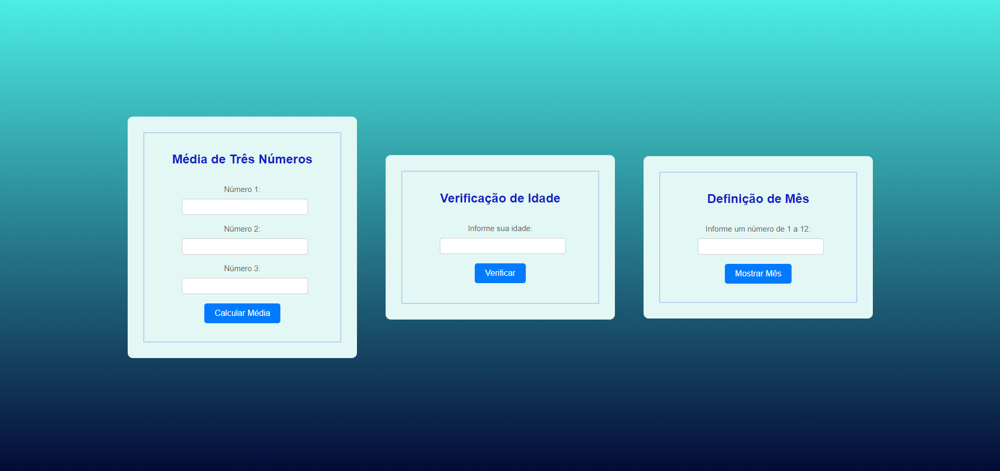

# Exercícios de JavaScript

Este projeto contém uma coleção de exercícios interativos de JavaScript que ajudam a praticar habilidades fundamentais de programação. 

## Descrição

Este projeto consiste em três exercícios simples de JavaScript integrados em uma página web. Cada exercício possui uma interface amigável onde o usuário pode inserir valores e ver os resultados diretamente na página.

## Como Usar

1. Abra o arquivo `index.html` no seu navegador preferido para interagir com os exercícios.

## Estrutura do Projeto

- `index.html`: Contém a estrutura HTML da página.
- `styles.css`: Contém os estilos CSS para a página.
- `index.js`: Contém os scripts JavaScript para os exercícios.

## Exercícios

### Exercício 1: Média de Três Números

Calcula a média de três números inseridos pelo usuário.

#### Instruções:
1. Insira três números nos campos fornecidos.
2. Clique no botão "Calcular Média".
3. Veja o resultado da média exibido abaixo do botão.

### Exercício 2: Verificação de Idade

Verifica se o usuário é maior ou menor de idade com base na idade fornecida.

#### Instruções:
1. Insira sua idade no campo fornecido.
2. Clique no botão "Verificar".
3. A verificação será exibida abaixo do botão.

### Exercício 3: Definição de Mês

Informa o nome do mês correspondente ao número inserido.

#### Instruções:
1. Insira um número de 1 a 12 no campo fornecido.
2. Clique no botão "Mostrar Mês".
3. O nome do mês correspondente será exibido abaixo do botão.

## Autor

Este projeto foi criado por [Vania Godoy] https://github.com/VaniaGodoy/exercicioJS_Descodificadas.

